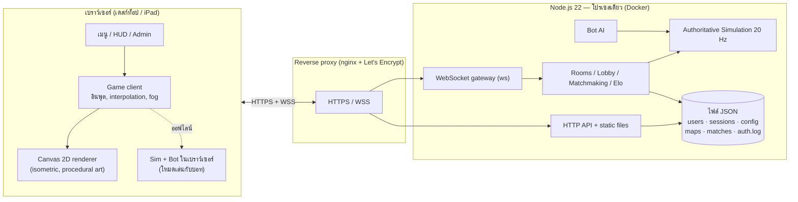
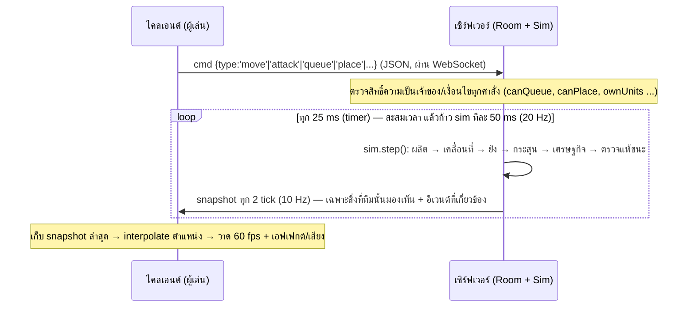

# Neon Alert — เอกสารความรู้ของโปรเจกต์ (Project Knowledge Base)

> เอกสารนี้เขียนให้ **ผู้บริหาร (CEO)** และ **ผู้เชี่ยวชาญด้านเทคนิค** อ่านแล้วเข้าใจตรงกันว่าโปรเจกต์นี้คืออะไร ทำงานอย่างไร ใช้สถาปัตยกรรมอะไร รองรับอะไรได้แค่ไหน และมีข้อจำกัดอะไรบ้าง
> ตัวเลขทุกตัวมีที่มา: **[วัดจริง]** = วัดจากโค้ด/เทสต์ในรีโป, **[ประมาณ]** = ประมาณการเชิงวิศวกรรมที่ยังไม่ได้ทดสอบโหลด, **[ตามโค้ด]** = ค่าที่กำหนดอยู่ในโค้ด
> ที่อยู่ระบบจริง: <https://neon-alert.napaphon.cloud/> · ซอร์สโค้ด: <https://github.com/hs6uej/neon-alert>

---

## สารบัญ

1. [สรุปสำหรับผู้บริหาร (อ่านหน้านี้หน้าเดียวก็พอ)](#1-สรุปสำหรับผู้บริหาร)
2. [ผลิตภัณฑ์คืออะไร — มุมมองผู้เล่น](#2-ผลิตภัณฑ์คืออะไร--มุมมองผู้เล่น)
3. [ความสามารถทั้งหมดแยกตามผู้ใช้](#3-ความสามารถทั้งหมดแยกตามผู้ใช้)
4. [สถาปัตยกรรมระบบ](#4-สถาปัตยกรรมระบบ)
5. [กลไกภายใน (สำหรับผู้เชี่ยวชาญ)](#5-กลไกภายใน-สำหรับผู้เชี่ยวชาญ)
6. [ข้อมูล ความปลอดภัย และความเป็นส่วนตัว](#6-ข้อมูล-ความปลอดภัย-และความเป็นส่วนตัว)
7. [การติดตั้งและการปฏิบัติการ (Deployment & Operations)](#7-การติดตั้งและการปฏิบัติการ)
8. [คุณภาพและการทดสอบ](#8-คุณภาพและการทดสอบ)
9. [ขีดความสามารถ (Capacity) และข้อจำกัด](#9-ขีดความสามารถ-capacity-และข้อจำกัด)
10. [ความเสี่ยง และข้อเสนอแนะ / Roadmap](#10-ความเสี่ยง-และข้อเสนอแนะ--roadmap)
11. [แผนที่โค้ด (Code Map)](#11-แผนที่โค้ด-code-map)
12. [ถาม–ตอบสำหรับผู้บริหาร](#12-ถามตอบสำหรับผู้บริหาร)
13. [ภาคผนวก: API, โปรโตคอล, คอนฟิก, ตัวแปรสภาพแวดล้อม](#13-ภาคผนวก)

---

## 1. สรุปสำหรับผู้บริหาร

**Neon Alert คือเกมวางแผนแบบเรียลไทม์ (Real-Time Strategy: RTS) ที่เล่นบนเว็บเบราว์เซอร์ทันที ไม่ต้องติดตั้ง** — ได้แรงบันดาลใจด้านรูปแบบการเล่นจาก *Command & Conquer: Red Alert 2* (สร้างฐาน เก็บแร่ ผลิตกองทัพ ทำลายศัตรู) แต่ทุกอย่างในเกม (ชื่อ ภาพ เสียง แผนที่ โค้ด) **สร้างขึ้นใหม่ทั้งหมด** ไม่ใช้ไฟล์ภาพ/เสียงจากภายนอกเลย

| หัวข้อ | สถานะ |
| --- | --- |
| **เล่นได้จริงแล้ว** | ✅ ออนไลน์อยู่ที่ neon-alert.napaphon.cloud (HTTPS, ต่ออายุใบรับรองอัตโนมัติ) |
| **โหมดเล่น** | เล่นกับบอท (ออฟไลน์ในเบราว์เซอร์), ห้องออนไลน์กับเพื่อน (รหัสห้อง 4 ตัว/ลิงก์เชิญ), จับคู่จัดอันดับ (Elo) |
| **ผู้เล่นต่อเกม** | 2–3 คน (คน/บอทผสมได้) |
| **อุปกรณ์** | เดสก์ท็อป (เมาส์+คีย์บอร์ด) และแท็บเล็ต iPad (ระบบสัมผัสเต็มรูปแบบ) |
| **ภาษา** | อังกฤษ / ไทย (สลับได้ทันที) |
| **ผู้ดูแลระบบ** | หน้า Admin ปรับสมดุลเกม, สร้างอาคาร/ยูนิต/อาวุธใหม่, สร้างแผนที่, จัดการผู้ใช้, ดู log — **โดยไม่ต้องแก้โค้ดหรือ deploy ใหม่** |
| **ต้นทุนโครงสร้างพื้นฐาน** | ต่ำมาก: โปรเซส Node.js เดียวใน Docker 1 คอนเทนเนอร์ บน VPS ที่ใช้ร่วมกับแอปอื่น ไม่มีฐานข้อมูลภายนอก ไม่มีค่าไลเซนส์ |
| **ขนาดโค้ด** [วัดจริง] | ≈ 7,900 บรรทัด JavaScript (เซิร์ฟเวอร์ + ไคลเอนต์) + ≈ 900 บรรทัดเทสต์ · ไม่มี build step · dependency เดียวคือ `ws` |

**จุดแข็งเชิงธุรกิจ/เทคนิค**
- *ทดลองเล่นได้ในวินาทีเดียว*: เปิดลิงก์ก็เล่น (ต้นทุนการเข้าถึงผู้ใช้ต่ำที่สุด)
- *ปรับเกมได้สด*: ทีมออกแบบเกมปรับสมดุล/คอนเทนต์ผ่านหน้า Admin ได้เอง — วงจรทดลองสั้นมาก
- *ฉลาดและเป็นธรรม*: เซิร์ฟเวอร์เป็น "ผู้ตัดสิน" (authoritative) และซ่อนข้อมูลที่ผู้เล่นไม่ควรเห็น (Fog of War ฝั่งเซิร์ฟเวอร์) จึงโกงยาก
- *ไม่มีสินทรัพย์ภายนอก*: ภาพ/เสียงถูกสร้างจากโค้ด — ไม่มีปัญหาลิขสิทธิ์ไฟล์ และโหลดเร็ว (ไคลเอนต์ทั้งหมด ≈ 0.5 MB [วัดจริง])

**ข้อควรรู้ (จุดที่ผู้บริหารควรตัดสินใจ/ติดตาม)**
1. **ยังเป็นสถาปัตยกรรมเซิร์ฟเวอร์เดี่ยว** (1 โปรเซส, เก็บข้อมูลเป็นไฟล์ JSON) — เหมาะกับหลักร้อยผู้ใช้/หลายสิบเกมพร้อมกัน แต่ **ยังไม่ผ่านการทดสอบโหลด** และการขยายเป็นหลักพัน–หมื่นต้องปรับสถาปัตยกรรม (ดูหัวข้อ 9–10)
2. การ deploy เวอร์ชันใหม่ **จะตัดเกมออนไลน์ที่กำลังเล่นอยู่** (สถานะห้อง/เกมอยู่ในหน่วยความจำ)
3. **ด้านกฎหมาย/แบรนด์**: เกมได้แรงบันดาลใจจากแนวเกมที่มีเจ้าของสิทธิ์ ชื่อ/ภาพ/โค้ดเป็นของใหม่ทั้งหมด แต่ก่อนทำการค้าเชิงพาณิชย์ควรให้ฝ่ายกฎหมายตรวจสอบชื่อและ trade dress (ไม่ใช่คำแนะนำทางกฎหมาย)
4. ยังไม่มีระบบวิเคราะห์การใช้งาน (analytics), การชำระเงิน, หรือการกู้คืนข้อมูลอัตโนมัติ (backup) — เป็นงานถัดไปหากต้องการเชิงพาณิชย์

---

## 2. ผลิตภัณฑ์คืออะไร — มุมมองผู้เล่น

### 2.1 แนวคิดเกม
ผู้เล่นแต่ละคนเริ่มด้วย **ศูนย์บัญชาการ (Nexus Core)** และทหารราบ 3 นาย ต้องวางแผนเศรษฐกิจ สร้างอาคาร ผลิตกองทัพ แล้วทำลายฐานของคู่แข่งให้หมด (คนสุดท้ายที่เหลือ/ทีมสุดท้ายที่เหลือชนะ)

```
ไฟฟ้า (Fusion Reactor) ──► โรงกลั่นแร่ (Ore Processor) ──► เงิน
        │                          │  (แถมรถเก็บแร่ 1 คัน)
        ├──► ค่ายทหาร (Barracks) ──► ทหารราบ
        └──► โรงงาน (Assembly Forge) ──► ยานพาหนะ ──► เรดาร์ ──► ห้องวิจัย ──► ยูนิตระดับสูง + อาวุธวินาศ
```

### 2.2 เนื้อหาในเกม (ค่าเริ่มต้น — ปรับได้ที่หน้า Admin)
| หมวด | รายการ |
| --- | --- |
| **อาคาร (9 ชนิด: เริ่มต้น 1 + สร้างได้ 8)** | Nexus Core *(เริ่มต้น สร้างเพิ่มไม่ได้ ยกเว้นตั้งจาก Mobile Nexus)*, Fusion Reactor, Ore Processor, Neural Barracks, Assembly Forge, Sensor Array, Quantum Lab, Pulse Tower, Orbital Uplink |
| **ทหารราบ (3)** | Pulse Trooper, Rocket Lancer (ยิงอากาศได้), Breach Engineer (ยึดอาคาร) |
| **ยานพาหนะ (8)** | Nano Harvester, Vector Hover, Arc Tank, Nova Mortar (ปืนใหญ่), Wasp Drone (บิน), Rail Striker, Titan Walker, Mobile Nexus (ตั้งฐานใหม่) |
| **อาวุธวินาศ** | Orbital Lance — ยิงจากวงโคจร เจาะกำแพงหิน โดนทุกอย่างรวมของฝ่ายเราเอง |
| **อาคารเป็นกลางบนแผนที่** | Crystal Derrick (ยึดแล้วได้เงินต่อเนื่อง), Supply Depot (ยึดแล้วได้โบนัสครั้งเดียว) |
| **แผนที่ (3 แบบดีไซน์ + สุ่ม)** | Triad Crossing, Sunken Isles, Iron Highlands, Wildlands (สุ่มใหม่ทุกเกม) + แผนที่ที่แอดมินสร้างเอง (สูงสุด 24) |
| **บอท AI** | 3 ระดับ (ง่าย/ปกติ/ยาก) ใช้ API คำสั่งชุดเดียวกับผู้เล่นจริง |

### 2.3 กลไกที่ทำให้เกมมีมิติ
- **ระบบไฟฟ้า**: ไฟไม่พอ → ผลิตช้าลง, ป้อมและเรดาร์ดับ, อาวุธวินาศไม่ชาร์จ
- **ตารางความเสียหาย × เกราะ (Damage class × Armor)**: อาวุธ 6 ประเภท × เกราะ 5 ประเภท (ทหาร/ยานเบา/เกราะหนัก/อาคาร/อากาศยาน) — เช่น ปืนราง (Rail) แรงต่อเกราะหนักแต่แย่ต่อทหาร
- **กำแพงหินทำลายได้**: หินภายในแผนที่มี HP ยิงเจาะทางลัดได้ (ขอบแผนที่ทำลายไม่ได้)
- **Fog of War**: เห็นเฉพาะพื้นที่ที่มียูนิต/อาคารของทีมมองเห็น
- **จับคู่จัดอันดับ Elo** และตารางอันดับ (Leaderboard) พร้อมสถิติส่วนตัว

---

## 3. ความสามารถทั้งหมดแยกตามผู้ใช้

### 3.1 ผู้เล่น
| ความสามารถ | รายละเอียด |
| --- | --- |
| บัญชีผู้ใช้ | สมัคร/เข้าสู่ระบบ (ชื่อ 3–16 ตัว, รหัสผ่าน 6–64 ตัว), เซสชันอยู่ 30 วัน |
| เล่นกับบอท | รันเกมทั้งหมด**ในเบราว์เซอร์** (ไม่ใช้ทรัพยากรเซิร์ฟเวอร์), เลือกบอท 1–2 ตัว, ความยาก, ทีม, เงินเริ่มต้น, ความเร็ว (1×/1.5×/2×), สี, แผนที่ |
| ห้องออนไลน์ | สร้างห้อง → รหัส 4 ตัวอักษร + ลิงก์เชิญ (`?room=CODE`), 3 ช่อง (คน/บอท/เปิด/ปิด), เลือกทีม สี แผนที่ ความเร็ว, แชตในห้อง/ล็อบบี้ |
| จับคู่จัดอันดับ | เข้าคิว → ระบบจับคู่ผู้เล่นที่เรตติ้งใกล้กัน (หน้าต่างเรตติ้งกว้างขึ้นตามเวลารอ) → ถ้าไม่มีคนพอ เติมบอท (ไม่นับอันดับ) |
| สถิติ | เรตติ้ง, อันดับ, ชนะ/แพ้, K/D, เวลาเล่น, ประวัติแมตช์, ประวัติการเข้าสู่ระบบของตัวเอง |
| คู่มือในเกม | ปุ่ม "Unit guide": รูป+ค่าสถานะ+คำอธิบาย+วิธีใช้ของทุกอาคาร/ยูนิต (EN/TH), ตัวเลขดึงจากข้อมูลจริงจึงตรงกับที่แอดมินปรับ |
| แถบสร้าง | แสดง**เฉพาะสิ่งที่สร้างได้ ณ ตอนนั้น** (ของที่ยังขาดอาคารต้นทางถูกซ่อน) |
| iPad / จอสัมผัส | แตะเลือก/สั่ง, ลากเลื่อนแผนที่, ถ่างนิ้วซูม, กดค้าง = เคลื่อนที่-โจมตี, ปุ่มบนจอ (Select/Attack/Stop/Base/Clear), แผ่นเลื่อนขอบจอขนาดใหญ่ 8 ทิศ, แถบยืนยัน "Build here" |
| เดสก์ท็อป | ลากกรอบ, คลิกขวาสั่ง, ปุ่มลัด (A/S/D/H/R/X/Tab/Ctrl+1-9), เลื่อนกล้องที่ขอบจอ (ทำงานแม้มี HUD ทับ), ล้อเมาส์ซูม |

### 3.2 ผู้ดูแลระบบ / นักออกแบบเกม (หน้า `/admin`)
| แท็บ | ทำอะไรได้ |
| --- | --- |
| **Structures / Units** | เห็น**รูป**ของทุกตัว · สวิตช์ **In battle** เปิด/ปิดว่าจะลงสนามรบหรือไม่ · แก้ราคา เวลาสร้าง HP ความเร็ว พลังงาน มองเห็น เกราะ อาวุธ ข้อกำหนด · **สร้างอาคาร/ยูนิตใหม่** (สำเนาของชนิดเดิมพร้อมความสามารถของต้นแบบ) |
| **Weapons** | แก้ดาเมจ/คูลดาวน์/ระยะ/สเปลช/ความเร็ว/ประเภท · **สร้างอาวุธใหม่** จากอาวุธเดิม |
| **Armor** | ตารางตัวคูณความเสียหาย (คลาสอาวุธ × เกราะ) |
| **Bot AI** | ปรับ 3 ระดับความยาก (จังหวะคิด ความเร็วผลิต โบนัสรายได้ ขนาดกองทัพ ฯลฯ) |
| **Rules** | กติกาทั่วไป: เงินเริ่มต้น ความเร็วเก็บแร่ อาวุธวินาศ ความเร็วซ่อม รัศมีก่อสร้าง HP หิน ฯลฯ |
| **Maps** | **ตัวแก้ไขแผนที่**: วาดบนกริด 96×96 (พื้น/หิน/น้ำ/แร่/จุดเริ่มต้น/อาคารเป็นกลาง), แปรงหลายขนาด, bucket fill, สมมาตร (หมุน×3/กระจก), Undo/Redo, เทมเพลต, ตรวจความถูกต้องสด, แผนที่ 2 หรือ 3 ผู้เล่น |
| **Users** | ตั้ง/ถอดแอดมิน, รีเซ็ตรหัสผ่าน, รีเซ็ตสถิติ, ลบบัญชี |
| **Sign-in logs** | บันทึกการเข้าสู่ระบบ/ล้มเหลว/สมัคร/การกระทำแอดมิน, กรอง, ส่งออก CSV |
| **Matches / Rooms** | ประวัติแมตช์, ห้องที่เปิดอยู่, คิวจับคู่, ปิดห้อง |

> การเปลี่ยนค่ามีผลกับ **เกมที่เริ่มใหม่** เท่านั้น (เกมที่กำลังเล่นไม่ถูกเปลี่ยนกลางคัน) และแอดมินกด Reset กลับค่าเริ่มต้นได้ทุกเมื่อ

### 3.3 ผู้ดูแลระบบโครงสร้างพื้นฐาน (Operator)
Docker + docker compose, healthcheck, ข้อมูลอยู่ใน volume, ตั้งค่าผ่านตัวแปรสภาพแวดล้อม (ดูภาคผนวก), reverse proxy + HTTPS ภายนอก

---

## 4. สถาปัตยกรรมระบบ

### 4.1 ภาพรวม



### 4.2 หลักการออกแบบสำคัญ (Design Decisions) และเหตุผล
| การตัดสินใจ | เหตุผล | ข้อแลกเปลี่ยน |
| --- | --- | --- |
| **Isomorphic JavaScript**: `data.js`, `config.js`, `mapdata.js`, `sim.js`, `ai.js` รันได้ทั้งใน Node และเบราว์เซอร์ | โค้ดกติกาเกม**ชุดเดียว** → โหมดออฟไลน์ = โหมดออนไลน์ ไม่มีกติกาสองชุดที่เพี้ยนกัน, เทสต์ใน Node ได้ | ต้องระวังไม่ให้โค้ดแกนกลางพึ่ง DOM/Node-specific |
| **Authoritative server** (เซิร์ฟเวอร์คำนวณเกมจริง ไคลเอนต์ส่งแค่ "คำสั่ง") | กันโกง, ทุกคนเห็นเหตุการณ์เดียวกัน, ซ่อนข้อมูล fog ได้ | เซิร์ฟเวอร์ต้องรันทุกเกม (CPU) |
| **Snapshot + interpolation** (ไม่ใช่ lockstep) | ทนความหน่วง/แพ็กเก็ตช้า, ผู้เล่นเข้า-ออกง่าย, กรองข้อมูลตามสายตาผู้เล่นได้ | ใช้แบนด์วิดท์มากกว่า lockstep |
| **ไม่มีไฟล์ภาพ/เสียง** (วาดด้วย Canvas, สังเคราะห์เสียงด้วย Web Audio) | ไม่มีปัญหาลิขสิทธิ์, โหลดเร็ว, ปรับสีผู้เล่น/ธีมได้ทันที | ศิลป์ต้องเขียนเป็นโค้ด (ยังไม่มีเครื่องมือวาดสไปรต์) |
| **Config เป็น "ตัวทับ" (overrides)** บนข้อมูลตั้งต้น | Reset ได้ทุกเมื่อ, ตรวจความถูกต้องรวมที่เดียว, ส่งให้ทุกไคลเอนต์ตอนเริ่มเกม | — |
| **ไฟล์ JSON แทนฐานข้อมูล** | ไม่มีบริการเพิ่ม, ตั้งค่าง่าย, เขียนแบบ atomic (tmp+rename) | ไม่รองรับหลายอินสแตนซ์/ไม่มีทรานแซกชัน |
| **ไม่มี build step / framework** (vanilla JS) | ขึ้นระบบเร็ว, ดีบักง่าย, dependency น้อยมาก (ลดความเสี่ยง supply-chain) | โค้ดฝั่ง UI เขียนมือ, ไม่มี type checking |

### 4.3 Tech stack
| ชั้น | เทคโนโลยี |
| --- | --- |
| Runtime | Node.js 22 (อิมเมจ `node:22-alpine`) |
| เซิร์ฟเวอร์ | `http` มาตรฐาน + `ws` (WebSocket, เปิด permessage-deflate) — dependency เดียวของโปรเจกต์ |
| ไคลเอนต์ | HTML + CSS + vanilla JS, Canvas 2D, Web Audio, Pointer Events (สัมผัส) |
| จัดเก็บ | ไฟล์ JSON ใน `data/` (volume) |
| การส่งมอบ | Docker + docker compose (ไม่รันด้วยสิทธิ์ root, มี healthcheck) |
| Edge | nginx reverse proxy + Let's Encrypt (certbot ต่ออายุอัตโนมัติ) บน VPS ที่ใช้ร่วมกับแอปอื่น |
| CI/CD | ยังไม่มี pipeline อัตโนมัติ — commit → merge → `docker compose up -d --build` |

---

## 5. กลไกภายใน (สำหรับผู้เชี่ยวชาญ)

### 5.1 วงจรของเกมออนไลน์ (Data flow)



- **Tick**: 20 Hz คงที่ (`DT = 0.05 s`) [ตามโค้ด], ส่ง snapshot 10 Hz [ตามโค้ด], รองรับเร่งความเร็ว 1×/1.5×/2×
- **Fog of War ฝั่งเซิร์ฟเวอร์**: `flush()` สร้าง snapshot แยกรายผู้เล่น — ศัตรูที่อยู่นอกระยะมองเห็นไม่ถูกส่งไปเลย (ผู้เล่นที่แพ้/เกมจบจึงเห็นทั้งแผนที่)
- **โปรโตคอลกะทัดรัด**: entity ส่งเป็น array (id, type-index, owner, x/y×16, hp, ang×50, …) เพื่อลดขนาด — snapshot กลางเกม 3 บอท ≈ **4.5–5.6 KB/คน** ก่อนบีบอัด [วัดจริงจาก `test/headless.js`]
- **ดัชนีชนิด (TIDX)**: entity อ้างชนิดด้วยลำดับใน `GA.TYPES` — เซิร์ฟเวอร์ส่ง `config` ทั้งชุดใน `start` message ให้ไคลเอนต์ apply ก่อนเริ่มเกม จึงตารางชนิด (รวมชนิดที่แอดมินสร้างเอง) ตรงกันเสมอ

### 5.2 Simulation (`sim.js`, ≈1,450 บรรทัด)
- **แผนที่**: กริด 96×96 ช่อง (`0`=พื้น, `1`=หิน, `2`=น้ำ) + ชั้นแร่; แผนที่ดีไซน์สร้างจากสูตรสมมาตร 3 ทิศด้วย noise ที่ seed คงที่, Wildlands สุ่มจาก seed ต่อเกม, มีขั้นตอน "ตรวจ/เจาะทางให้ทุกฐานและกองแร่เดินถึงกัน"
- **Pathfinding**: A\* (binary heap) 8 ทิศ + ห้ามตัดมุม + *string pulling* (ลดจุดเลี้ยว) + line-of-sight ตรวจความกว้างตัวยูนิต
- **Spatial hash** (เซลล์ 4×4) สำหรับหาเป้าหมาย/แยกยูนิตซ้อนกัน
- **การต่อสู้**: อาวุธ (dmg, cooldown, range, projectile speed, splash, targets ground/air) × ตารางเกราะ; กระสุนมีเวลาบิน; splash ลดตามระยะ; อาคารระเบิดสร้างความเสียหายรอบข้าง
- **เศรษฐกิจ**: รถเก็บแร่ทำงานอัตโนมัติ (หาแร่ → ขุด → กลับโรงกลั่นที่ใกล้สุด → ขนถ่าย); ผลิตด้วยคิวแยก 3 หมวด (อาคาร/ทหาร/ยานพาหนะ) เก็บเงินระหว่างผลิต; ไฟไม่พอชะลอผลิต; ค่ายเพิ่มเร่งการผลิต
- **ความสามารถเฉพาะ**: ยึดอาคาร (Engineer), ตั้งฐานใหม่ (MCV), อาวุธวินาศ, ซ่อม/ขาย, rally point, อาคารเป็นกลาง (Derrick/Depot มี "ผู้เล่นเป็นกลาง" ที่ไม่มีวันชนะ/แพ้และไม่ถูกยิงอัตโนมัติ), หินทำลายได้ (HP ต่อช่อง + อีเวนต์ `rock` broadcast ให้ทุกคน)
- **การเป็นตัวแทนชนิด (role/look)**: ชนิดที่แอดมินสร้างเองเป็น "สำเนาของต้นแบบ" มี `role` (พฤติกรรม: ค่ายทหารสำเนายังผลิตทหารได้ โรงกลั่นสำเนายังรับแร่ได้) และ `look` (ภาพที่ใช้วาด) — `GA.roleOf(def)` เป็นจุดเดียวที่ sim/AI/UI ใช้ตัดสินพฤติกรรม

### 5.3 บอท AI (`ai.js`, ≈260 บรรทัด)
- ทำงานผ่าน `sim.cmd(...)` เหมือนผู้เล่น (ไม่มีทางลัดโกงยกเว้นโบนัสรายได้ระดับยาก)
- ลำดับการสร้าง: ไฟ → โรงกลั่น → ค่าย → โรงงาน → เรดาร์ → ป้อม → ห้องวิจัย → อาวุธวินาศ ฯลฯ; ผลิตกองทัพแบบถ่วงน้ำหนัก; ส่งกองทัพเป็นระลอก (ขนาด/ช่วงเวลาตามระดับ); ป้องกันฐานเมื่อโดนโจมตี
- **ข้ามสิ่งที่แอดมินปิด** (รวมถึงสิ่งที่ขึ้นกับของที่ปิด) เพื่อไม่ค้างรอของที่สร้างไม่ได้; ไม่สร้างชนิดที่แอดมินสร้างเอง

### 5.4 เครือข่ายและห้อง (`server.js`, ≈900 บรรทัด)
- **Room**: 3 ช่อง (`human | bot | open | closed`), โฮสต์ = ช่อง 0 (โอนให้คนถัดไปเมื่อโฮสต์ออก), สีไม่ซ้ำ, แผนที่ 2 ผู้เล่นจะปิดช่องที่ 3 ให้อัตโนมัติ
- **ผู้เล่นหลุดกลางเกม** → บอทเข้าคุมแทน (บันทึกเป็น "quit" ในอันดับ), ห้องจบเกมแล้วถูกลบหลัง 5 นาที
- **Matchmaking**: คิวตรวจทุก 1 วินาที; หน้าต่างเรตติ้ง = `150 + 20×วินาทีที่รอ`; ครบ 3 คน = เริ่มทันที, 2 คน รอ ≥15 วินาที, 1 คน (ยอมให้เติมบอท) รอ ≥40 วินาที → เติมบอท 2 ตัว (ไม่นับอันดับ), นับถอยหลัง 5 วินาทีก่อนเริ่ม (ปรับได้ด้วย env) [ตามโค้ด]
- **Elo แบบ FFA**: ทุกคู่ของผู้เล่นจริงคือการดวลย่อยที่ตัดสินด้วยอันดับที่ได้ (K=32 หารตามจำนวนคู่แข่ง, ผลรวมเป็นศูนย์), เรตติ้งขั้นต่ำ 100, แมตช์ที่ผู้เล่นจริงน้อยกว่า 2 คนไม่นับอันดับ; เกมที่ทิ้งก่อน 30 วินาทีไม่บันทึก
- **WebSocket**: จำกัด payload 64 KB, ยืนยันตัวตนด้วย token ในข้อความแรก (`auth`), ใหม่แทนเก่า (เข้าสู่ระบบซ้อน → ตัวเก่าถูกตัด)

### 5.5 ไคลเอนต์ (`game.js`, `render.js`, `ui.js`, `main.js`)
- **เรนเดอร์ isometric** ด้วย Canvas 2D: วาดพื้น น้ำ (คลื่น) แร่ (ผลึก) หิน (กล่อง 3D พร้อมรอยแตกตามความเสียหาย) อาคาร/ยูนิตแบบ procedural (กล่อง/ทรงกระบอก/เรืองแสง), เงา, อนุภาค, fog-of-war overlay, มินิแมพ; เรียงลำดับความลึกแบบ painter's algorithm
- **อินพุต**: เมาส์/คีย์บอร์ด + Pointer Events สำหรับสัมผัส (tap/drag-pan/pinch/long-press, ปุ่มบนจอ, แผ่นเลื่อนขอบจอ) — ยกเลิก mouse event ที่เบราว์เซอร์สังเคราะห์ซ้ำหลังการสัมผัส
- **การแปลภาษา** (`i18n.js`): พจนานุกรม EN→TH + รูปแบบ regex สำหรับข้อความแบบไดนามิก; `MutationObserver` แปล DOM ที่ถูกเพิ่มทั้งหมดโดยอัตโนมัติ (คำที่ตกหล่นเก็บไว้ใน `GA.i18nMissing` เพื่อตรวจ)
- **เสียง** (`audio.js`): สังเคราะห์เอฟเฟกต์ เสียงประกาศ และเพลง synthwave แบบสร้างสดด้วย Web Audio (ไม่มีไฟล์เสียง)

### 5.6 ระบบคอนฟิกและคอนเทนต์ที่แอดมินจัดการได้ (`config.js`, `mapdata.js`)
```jsonc
// data/config.json — "ตัวทับ" เฉพาะที่ต่างจากค่าตั้งต้น
{
  "defs":     { "arc": { "cost": 900 } },            // แก้ชนิดเดิม
  "weapons":  { "pulse": { "dmg": 12 } },
  "mult":     { "rail": { "inf": 0.5 } },            // ตารางเกราะ
  "bots":     { "hard": { "delay": 200 } },
  "settings": { "startCredits": 8000 },
  "custom":   { "types":   { "x_bar2": { "base": "barracks", "name": "Field Barracks" } },
                "weapons": { "w_zap":  { "base": "pulse", "dmg": 80 } } },
  "disabled": ["nova", "turret"]                      // ไม่ลงสนามรบ
}
```
- `cleanConfig()` เป็น **จุดตรวจความถูกต้องเดียว** (ทั้งเซิร์ฟเวอร์และไคลเอนต์ใช้ตัวเดียวกัน): ตัดฟิลด์ไม่รู้จัก, บีบค่าให้อยู่ในช่วง, กัน id ผิดรูปแบบ, กันการปิดชนิดที่เกมขาดไม่ได้ (Nexus Core / Fusion Reactor / Ore Processor / Nano Harvester), จำกัด 24 ชนิดและ 12 อาวุธที่สร้างเอง
- **แผนที่ที่สร้างเอง** เก็บใน `data/maps.json`: ภูมิประเทศแบบ run-length (`"0:120,1:3,..."` ≈ 2–5 KB/แผนที่ [วัดจริง]), แร่แบบ sparse, จุดเริ่มต้น 2–3 จุด, อาคารเป็นกลาง — ตรวจซ้ำที่เซิร์ฟเวอร์ (เดินถึงกันไหม, ตำแหน่งวางถูกไหม ฯลฯ) และเผยแพร่ผ่าน `GET /api/config`

---

## 6. ข้อมูล ความปลอดภัย และความเป็นส่วนตัว

### 6.1 ข้อมูลที่เก็บ (ทั้งหมดอยู่ใน `data/` บน Docker volume)
| ไฟล์ | เนื้อหา | ความอ่อนไหว |
| --- | --- | --- |
| `users.json` | ชื่อผู้ใช้, **hash รหัสผ่าน (scrypt + salt)**, บทบาท, เรตติ้ง/สถิติ, เวลา/ไอพีที่เข้าล่าสุด | สูง (PII เบื้องต้น) |
| `sessions.json` | token เซสชัน (หมดอายุ 30 วัน) | สูง |
| `auth.log` | บันทึกเหตุการณ์ (เข้า/ออก/ล้มเหลว/สมัคร/การกระทำแอดมิน) พร้อม IP และ User-Agent — หมุนไฟล์ที่ 2 MB | กลาง (มี IP) |
| `matches.json` | ประวัติ 500 แมตช์ล่าสุด | ต่ำ |
| `config.json`, `maps.json` | คอนฟิกเกมและแผนที่ | ต่ำ |

- ไม่มีการเก็บอีเมล เบอร์โทร หรือข้อมูลชำระเงิน; ไม่มี analytics/third-party script; โหลดฟอนต์/ไลบรารีจากภายนอก: **ไม่มี**
- ผู้ใช้เห็นประวัติการเข้าสู่ระบบของตัวเอง (โปร่งใส) — แอดมินเห็น log ของทุกคน

### 6.2 มาตรการความปลอดภัยที่มี
| ด้าน | มาตรการ |
| --- | --- |
| รหัสผ่าน | scrypt พร้อม salt ต่อผู้ใช้, ไม่มีทางดูรหัสได้ (แอดมินทำได้เพียงรีเซ็ต) |
| Brute force | ล็อกไอพีหลังล้มเหลว 8 ครั้ง นาน 5 นาที (`429`) และบันทึก log [ตามโค้ด] |
| สิทธิ์ | ทุก endpoint `/api/admin/*` ตรวจ token + บทบาท `admin` ฝั่งเซิร์ฟเวอร์; แอดมินคนสุดท้ายลดสิทธิ์/ลบตัวเองไม่ได้ |
| การตรวจอินพุต | ทุกคำสั่งเกมถูกตรวจฝั่งเซิร์ฟเวอร์ (เป็นเจ้าของยูนิตจริงไหม, เงื่อนไขสร้างได้ไหม, ช่วงค่า); คอนฟิก/แผนที่ผ่าน validator กลาง; ข้อความที่ผู้ใช้/แอดมินป้อนแสดงด้วย `textContent` หรือถูก escape ก่อนลง HTML และตัด `<>` ที่ชั้นข้อมูล |
| การโกง | เซิร์ฟเวอร์เป็นผู้ตัดสิน + fog-of-war ฝั่งเซิร์ฟเวอร์ (ไม่ส่งศัตรูที่มองไม่เห็น) |
| การส่งข้อมูล | HTTPS/WSS ยุติที่ nginx; แอปอ่าน IP จริงจาก `X-Forwarded-For` เมื่อ `TRUST_PROXY=1` |
| คอนเทนเนอร์ | รันด้วยผู้ใช้ `node` (ไม่ใช่ root), healthcheck |

### 6.3 ช่องว่างด้านความปลอดภัยที่ควรทราบ (ยังไม่ทำ)
- token เก็บใน `localStorage` ของเบราว์เซอร์ (ต้องระวัง XSS; ตอนนี้ไม่มีการฝังสคริปต์ภายนอก)
- ไม่มี rate limit ทั่วไปสำหรับ API/WebSocket (มีเฉพาะ login และขีดจำกัดขนาดข้อความ)
- ไม่มี 2FA/อีเมลกู้รหัสผ่าน (การรีเซ็ตต้องให้แอดมินทำ)
- พอร์ตแอปถูกเปิดตรง (HTTP) บนโฮสต์นอกเหนือจากผ่าน nginx — ควร bind เฉพาะ `127.0.0.1`
- ไม่มีการสำรองข้อมูลอัตโนมัติ
- ผลเกมออฟไลน์ที่ไคลเอนต์รายงานเป็นสถิติแยก **ไม่นับอันดับ** เพราะเชื่อถือไม่ได้

---

## 7. การติดตั้งและการปฏิบัติการ

### 7.1 โครงสร้างการ deploy ปัจจุบัน
```
ผู้เล่น ──HTTPS/WSS──► nginx (VPS ร่วมกับแอปอื่น, ใบรับรอง Let's Encrypt ต่ออายุอัตโนมัติ)
                          └─ proxy_pass ─► คอนเทนเนอร์ neon-alert (Node 22, พอร์ต 9988)
                                              └─ volume neon-alert-data ► /app/data (JSON)
```
- nginx ตั้ง `Upgrade/Connection` สำหรับ WebSocket และ timeout ยาว (เกมเปิดการเชื่อมต่อค้าง)
- ตั้ง `TRUST_PROXY=1` ให้ log เก็บ IP จริง

### 7.2 คำสั่งที่ใช้บ่อย
```bash
# รันบนเครื่อง (ต้องใช้ Node ≥ 18 เพื่อ fetch ในสคริปต์ทดสอบ; production ใช้ Node 22 ใน Docker)
npm ci && npm start                     # http://localhost:3000
docker compose up -d --build            # สร้างและรัน (อ่านค่าจาก .env)
docker logs -f neon-alert               # ดู log
npm test                                # เทสต์ทั้งชุด (ดูหัวข้อ 8)
```

### 7.3 ขั้นตอนปล่อยเวอร์ชันใหม่ (ปัจจุบัน)
`git commit` → merge เข้า `main` → `docker compose up -d --build` → `git push` — ใช้เวลาไม่กี่นาที แต่ **ตัดเกมที่กำลังเล่น** และผู้เล่นต้องรีเฟรชหน้าเพื่อโหลดไฟล์ใหม่ (ไฟล์ static ส่ง `Cache-Control: no-cache`)

### 7.4 ข้อแนะนำด้านปฏิบัติการ
- สำรอง volume `neon-alert-data` เป็นประจำ (ข้อมูลผู้ใช้ทั้งหมดอยู่ที่นี่)
- เฝ้าดู: สถานะ healthy ของคอนเทนเนอร์, ขนาด `auth.log`, CPU ของโปรเซส Node (ถ้า tick หนักจะเห็นเป็น latency)
- เปลี่ยนรหัสแอดมินเริ่มต้นใน `.env` ก่อนเปิดใช้งานจริง (บัญชีนี้ถูกสร้างครั้งแรกเท่านั้น การเปลี่ยนใน `.env` ภายหลังไม่มีผลกับบัญชีที่มีอยู่แล้ว)

---

## 8. คุณภาพและการทดสอบ

### 8.1 ชุดทดสอบอัตโนมัติในรีโป (`npm test` / `test/*.js`)
| ไฟล์ | ครอบคลุม |
| --- | --- |
| `headless.js` | จำลองเกมบอท 3 ตัว 12 นาที: เศรษฐกิจ, AI, การต่อสู้, ประสิทธิภาพ tick, ขนาด snapshot |
| `features.js` | เศรษฐกิจ, ซ่อม/ขาย, ยึดอาคาร, MCV, การรบ, อาวุธวินาศ, เงื่อนไขชนะ, สร้างแผนที่, apply/reset คอนฟิก |
| `destructible.js` | กำแพงหินทำลายได้ (สั่งยิง/สเปลช/Orbital Lance), อาคารเป็นกลาง (ยึด/รายได้/โบนัส/ไม่ถูกยิงอัตโนมัติ/เดินถึงได้ทุกแผนที่), snapshot |
| `custommaps.js` | การเข้ารหัสแผนที่, validator, แผนที่ 2 ผู้เล่น, เล่นจริงบนแผนที่ที่สร้างเอง |
| `customtypes.js` | ชนิดที่สร้างเอง (role/look), สวิตช์ปิด, บอทที่ทำงานได้แม้ปิดบางอย่าง, ตารางชนิดคงที่ |
| `net-test.js` | End-to-end กับเซิร์ฟเวอร์จริง: บัญชี, สิทธิ์แอดมิน, คอนฟิก/แผนที่, ล็อบบี้/ห้อง, เริ่มเกม, จับคู่ Elo, log |

> `npm test` รัน headless + destructible + custommaps + customtypes; `features.js` และ `net-test.js` รันแยก (`net-test.js` ต้องใช้ Node ≥ 18 เพราะใช้ `fetch` — ผมรันใน Docker `node:22-alpine`) — ณ วันที่เขียนเอกสารทุกชุดผ่านทั้งหมด

### 8.2 ที่ทดสอบนอกรีโป (ตอนพัฒนา)
เบราว์เซอร์จริงแบบอัตโนมัติ (Playwright/Chromium): ตัวแก้ไขแผนที่, การวาด/สมมาตร/Undo, กำแพงหิน, การสัมผัส (จำลอง iPad ด้วยเหตุการณ์ touch จริง: แตะ/ลาก/ถ่างนิ้ว/กดค้าง), แถบสร้าง, หน้า Admin, การแปลภาษา — **สคริปต์เหล่านี้ยังไม่ได้เก็บไว้ในรีโป**

### 8.3 ที่ยังไม่ครอบคลุม
- ไม่มี CI อัตโนมัติ และไม่มี E2E บนเบราว์เซอร์ในรีโป
- **ยังไม่ทดสอบบน iPad จริง** (ทดสอบด้วยการจำลองสัมผัส) และยังไม่ทดสอบโหลด/สเกล
- ไม่มีการทดสอบด้านการเข้าถึง (accessibility) และไม่มี fuzzing โปรโตคอล

---

## 9. ขีดความสามารถ (Capacity) และข้อจำกัด

### 9.1 ตัวเลขที่วัดได้
| ตัวชี้วัด | ค่า | ที่มา |
| --- | --- | --- |
| เวลาประมวลผล sim เฉลี่ย | ≈ **0.25 ms ต่อ tick** (เกมบอท 3 ตัว 10–12 นาทีเกม ใช้เวลาจริง ≈ 3 วินาที) | [วัดจริง] `test/headless.js` |
| tick ที่หนักที่สุด | ≈ **30–35 ms** (งบต่อ tick = 50 ms) เกิดตอน pathfinding พร้อมกันจำนวนมาก | [วัดจริง] |
| ขนาด snapshot | ≈ 4.5–5.6 KB/คน กลางเกม (JSON ก่อนบีบอัด) → ≈ **45–56 KB/s ต่อผู้เล่นสูงสุด** ที่ 10 Hz | [วัดจริง] + คำนวณ |
| ขนาดไคลเอนต์ทั้งหมด | ≈ 0.5 MB (ไม่มีรูป/เสียง) | [วัดจริง] |
| ขนาดแผนที่ที่สร้างเอง | ≈ 2–5 KB ต่อแผนที่ (บีบอัด run-length) | [วัดจริง] |

### 9.2 ประมาณการความจุ (ยังไม่ได้ทดสอบโหลด)
- CPU ของ sim ≈ 0.5% ของ 1 core ต่อเกมที่กำลังเล่น (0.25 ms × 20 tick/s) + ค่าสร้าง/serialize snapshot ที่ใกล้เคียงกันอีกส่วนหนึ่ง → **ประมาณการ: ระดับ "หลายสิบเกมพร้อมกัน" ต่อ 1 core** [ประมาณ]
- แบนด์วิดท์: ≈ 1.4 Mbps ต่อเกม 3 คน ก่อนบีบอัด (มี permessage-deflate ช่วยลดได้หลายเท่า) [ประมาณ]
- ข้อควรระวัง: Node เป็นเธรดเดียว — เกมทุกเกมแชร์ event loop เดียวกัน tick ที่ spike (30+ ms) ของเกมหนึ่งจะกระทบเกมอื่นในโปรเซสเดียวกัน
- โหมดเล่นกับบอทรันในเบราว์เซอร์จึง **ไม่ใช้ทรัพยากรเซิร์ฟเวอร์** (มีเพียงการรายงานผลสถิติ)

### 9.3 ข้อจำกัดของผลิตภัณฑ์/สถาปัตยกรรม
| ข้อจำกัด | รายละเอียด |
| --- | --- |
| ผู้เล่นต่อเกม | 2–3 (ตามจำนวนจุดเริ่มต้นของแผนที่; ค่าคงที่ในการออกแบบห้อง/สี/ทีม) |
| ขนาดแผนที่ | คงที่ 96×96 ช่อง |
| สเกลแนวนอน | โปรเซสเดียว/เซิร์ฟเวอร์เดียว: ห้อง คิวจับคู่ และเซสชันอยู่ในหน่วยความจำ → รีสตาร์ท = เกมที่เล่นอยู่จบ; รัน 2 อินสแตนซ์คู่กันไม่ได้ (ไฟล์ JSON ไม่ปลอดภัยต่อการเขียนพร้อมกัน) |
| ที่เก็บข้อมูล | ไฟล์ JSON (เขียนแบบ atomic, หน่วง 150 ms) — ไม่มีทรานแซกชัน/ดัชนี/ข้อความค้นหา |
| ระหว่างเกม | ไม่มี spectator, replay, หรือ rejoin กลับเข้าเกมเดิม (หลุด = บอทคุมแทน) |
| ศิลป์ของชนิดที่สร้างเอง | ใช้ภาพของต้นแบบ (ติดเครื่องหมายเพชรทอง) — ยังไม่มีเครื่องมือวาดสไปรต์ใหม่ |
| บอทกับคอนเทนต์ใหม่ | บอทไม่สร้างชนิดที่แอดมินสร้างเอง และไม่เจาะกำแพง/ยึดอาคารเป็นกลาง |
| ความหน่วง | ออกแบบให้ทนความหน่วงปกติของอินเทอร์เน็ตด้วย snapshot 10 Hz + interpolation (ความหน่วงของภาพ ≈ 100–200 ms) แต่ยังไม่มีการชดเชยขั้นสูง |
| ภาษา | EN/TH เท่านั้น |
| อุปกรณ์ | เบราว์เซอร์สมัยใหม่ที่รองรับ Canvas 2D/WebSocket/Pointer Events; ไม่รองรับปุ่มลัดกลุ่มยูนิตบนจอสัมผัส |
| การเปลี่ยนคอนฟิก | มีผลกับเกมที่เริ่มใหม่เท่านั้น |

---

## 10. ความเสี่ยง และข้อเสนอแนะ / Roadmap

### 10.1 ทะเบียนความเสี่ยง
| # | ความเสี่ยง | ผลกระทบ | โอกาส | แนวทางลด |
| --- | --- | --- | --- | --- |
| R1 | เซิร์ฟเวอร์/ดิสก์เสียโดยไม่มี backup | เสียบัญชี/อันดับทั้งหมด | กลาง | สำรอง volume อัตโนมัติ (cron + off-site), ระยะยาวย้ายไป DB ที่มี replication |
| R2 | Deploy ตัดเกมที่กำลังเล่น | ผู้เล่นเสียเกม/เรตติ้ง | สูงทุกครั้งที่ปล่อย | ปล่อยนอกชั่วโมงเล่น, แจ้งเตือนในเกม, "drain mode" (ไม่รับห้องใหม่ก่อนปิด) |
| R3 | ทราฟฟิกพุ่งเกินความจุโปรเซสเดียว | เกมกระตุก/หลุด | ต่ำ–กลาง | ทดสอบโหลด → แยกโปรเซส/เซิร์ฟเวอร์ตามห้อง (ดู Roadmap) |
| R4 | บัญชี/Token ถูกขโมย | เข้าถึงบัญชีผู้เล่น/แอดมิน | ต่ำ–กลาง | 2FA สำหรับแอดมิน, rate limit ทั่วไป, ผูก token กับอุปกรณ์, จำกัดพอร์ตตรง |
| R5 | แบรนด์/ลิขสิทธิ์ (แรงบันดาลใจจากเกมที่มีเจ้าของสิทธิ์) | ข้อพิพาทเมื่อทำการค้า | ต่ำ | ตรวจชื่อ/ภาพ/ข้อความโดยฝ่ายกฎหมาย, ยึดแนวสินทรัพย์ใหม่ทั้งหมด (ทำอยู่แล้ว) |
| R6 | ปัญหาบนอุปกรณ์จริง (iPad/Safari) ที่การจำลองไม่พบ | ประสบการณ์สัมผัสไม่ดี | กลาง | ทดสอบบน iPad จริง 1–2 รุ่น, เก็บ feedback |
| R7 | คนดูแลระบบน้อย/ความรู้กระจุก | บำรุงรักษายาก | กลาง | เอกสารนี้ + README, เพิ่ม CI และเทสต์ E2E ในรีโป |

### 10.2 Roadmap ที่แนะนำ (เรียงตามคุ้มค่า)
**ระยะสั้น (ทำได้ทันที, ต้นทุนต่ำ)**
1. bind พอร์ตแอปที่ `127.0.0.1` + สำรอง `data/` อัตโนมัติ
2. เก็บสคริปต์ E2E (Playwright) เข้ารีโปและตั้ง CI (GitHub Actions) รัน `npm test` + net-test บน Node 22
3. ทดสอบบน iPad จริง แล้วปรับขนาด/ความไวปุ่ม
4. เพิ่ม rate limit ทั่วไปและ metrics พื้นฐาน (จำนวนห้อง/ผู้เล่น/tick p95)

**ระยะกลาง**
5. **ทดสอบโหลด** (บอท WebSocket จำลองผู้เล่นหลายร้อยคน) เพื่อหาเพดานจริงแทนตัวเลขประมาณการ
6. ย้ายข้อมูลผู้ใช้ไป SQLite/PostgreSQL; แยก "game worker" ออกจาก "API/lobby" (worker threads หรือหลายโปรเซส เลือกตามห้อง)
7. Spectator + Replay (บันทึกคำสั่ง + seed เพราะ sim แบบกำหนดผลได้จาก seed และคำสั่ง)
8. เครื่องมือสร้างภาพ (sprite/icon editor) ให้ชนิดที่สร้างเองมีหน้าตาเฉพาะ; ให้บอทรู้จักชนิดใหม่/กำแพง/อาคารเป็นกลาง

**ระยะยาว / เชิงธุรกิจ**
9. Analytics (retention, ความยาวแมตช์, จุดที่ผู้เล่นเลิกเล่น), ระบบเพื่อน/คลาน/ทัวร์นาเมนต์
10. การรองรับผู้เล่นมากกว่า 3 คนต่อเกมและแผนที่ขนาดต่างๆ (ต้องปรับโครงสร้างสี/ทีม/จุดเริ่มต้น)
11. Monetization (เช่น เครื่องสำอาง/ธีมสี/แพ็กแผนที่) โดยไม่กระทบความยุติธรรม; PWA/แอปห่อ (Capacitor) เพื่อขึ้น App Store

---

## 11. แผนที่โค้ด (Code Map)

| ไฟล์ | บรรทัด [วัดจริง] | หน้าที่ | รันที่ |
| --- | ---: | --- | --- |
| `server.js` | 916 | HTTP API, static, WebSocket, บัญชี/เซสชัน, ห้อง, จับคู่, Elo, log, เก็บไฟล์, คอนฟิกและแผนที่แอดมิน | Node |
| `public/js/data.js` | 134 | ข้อมูลตั้งต้น: อาคาร/ยูนิต/อาวุธ/ตารางเกราะ/กติกา/รายชื่อแผนที่ | ทั้งสอง |
| `public/js/config.js` | 256 | ระบบ override: schema, `cleanConfig`, `applyConfig`, ชนิดที่สร้างเอง, สวิตช์ปิด | ทั้งสอง |
| `public/js/mapdata.js` | 165 | รูปแบบ/ตัวตรวจ/ทะเบียนแผนที่ที่สร้างเอง | ทั้งสอง |
| `public/js/sim.js` | 1,449 | สร้างแผนที่, pathfinding, การรบ, เศรษฐกิจ, คำสั่ง, snapshot/fog, อาคารเป็นกลาง, หินทำลายได้ | ทั้งสอง |
| `public/js/ai.js` | 264 | บอท | ทั้งสอง |
| `public/js/net.js` | 71 | ตัวส่งข้อมูล: LocalTransport (ออฟไลน์) / WSTransport (ออนไลน์) | เบราว์เซอร์ |
| `public/js/game.js` | 862 | สถานะไคลเอนต์, interpolation, อินพุต (เมาส์/คีย์/สัมผัส), การเลือก/สั่งงาน, กล้อง | เบราว์เซอร์ |
| `public/js/render.js` | 1,001 | เรนเดอร์ isometric แบบ procedural, ไอคอน, มินิแมพ | เบราว์เซอร์ |
| `public/js/ui.js` | 362 | HUD, แถบสร้าง, แผงเลือก, toast, แชต | เบราว์เซอร์ |
| `public/js/main.js` | 548 | บัญชี, เมนู, ล็อบบี้/ห้อง, วงจรเกม | เบราว์เซอร์ |
| `public/js/guide.js` | 517 | คู่มืออาคาร/ยูนิตในเกม | เบราว์เซอร์ |
| `public/js/i18n.js` | 343 | แปล EN↔TH | เบราว์เซอร์ |
| `public/js/audio.js` | 135 | เสียงสังเคราะห์ | เบราว์เซอร์ |
| `public/js/admin.js` | 426 | หน้า Admin (คอนฟิก, ชนิดที่สร้างเอง, ผู้ใช้, log, ห้อง) | เบราว์เซอร์ |
| `public/js/mapeditor.js` | 416 | ตัวแก้ไขแผนที่ | เบราว์เซอร์ |
| `public/index.html`, `admin.html`, `css/style.css` | 243 / 90 / 357 | หน้าเว็บและสไตล์ (รวมชุดสัมผัส) | เบราว์เซอร์ |
| `test/*.js` | ≈ 900 | ชุดทดสอบ | Node |
| `Dockerfile`, `docker-compose.yaml`, `.env.example` | — | การส่งมอบ/ตั้งค่า | — |

**ประวัติการพัฒนา (Git):** เริ่มจากเกมหลัก → คู่มือยูนิต + แก้ไอคอน → เลื่อนกล้องด้วยเมาส์ 8 ทิศ → กำแพงหินทำลายได้ + อาคารเป็นกลาง → ตัวแก้ไขแผนที่ → แผนที่ 2 ผู้เล่น → ระบบสัมผัส iPad + แถบสร้างเฉพาะที่สร้างได้ → เครื่องมือสร้างอาคาร/ยูนิต/อาวุธ + สวิตช์เปิดปิด

---

## 12. ถาม–ตอบสำหรับผู้บริหาร

**Q: ผู้ใช้ต้องติดตั้งอะไรไหม?** ไม่ต้อง เปิดลิงก์บนเบราว์เซอร์ (เดสก์ท็อปหรือ iPad) ก็เล่นได้

**Q: ใช้ค่าใช้จ่ายอะไรบ้าง?** ค่า VPS/โดเมน/ใบรับรอง (ฟรีจาก Let's Encrypt) เท่านั้น — ไม่มีฐานข้อมูลเสียเงิน ไม่มีค่าไลเซนส์ซอฟต์แวร์/สินทรัพย์ (ณ ตอนนี้ระบบรันบนเซิร์ฟเวอร์ที่ใช้ร่วมกับแอปอื่น)

**Q: รองรับผู้ใช้กี่คน?** ยังไม่เคยทดสอบโหลด ประมาณการเชิงวิศวกรรมคือ "หลายสิบเกมพร้อมกันต่อ 1 core" (หลักร้อยคนพร้อมกัน) — ถ้าต้องการหลักพันขึ้นไปต้องแยก game worker/ย้ายฐานข้อมูล (ดู Roadmap 5–6)

**Q: ทีมออกแบบเกมแก้สมดุลเองได้ไหม?** ได้ผ่านหน้า Admin ทั้งค่าเดิม อาคาร/ยูนิต/อาวุธใหม่ แผนที่ใหม่ และเปิด/ปิดชนิดที่ไม่เอาลงสนาม โดยไม่ต้องเขียนโค้ดหรือ deploy ใหม่ (มีผลกับเกมที่เริ่มหลังบันทึก)

**Q: โกงได้ไหม?** ยากขึ้นมาก เพราะเซิร์ฟเวอร์คำนวณเกมจริงและไม่ส่งข้อมูลที่ผู้เล่นไม่ควรเห็น สิ่งที่ยังไม่มี: ระบบตรวจจับพฤติกรรมผิดปกติ/บอทช่วยเล่น

**Q: ถ้าเซิร์ฟเวอร์ล่มหรือ deploy ใหม่ ข้อมูลหายไหม?** ข้อมูลผู้ใช้/คอนฟิก/แผนที่อยู่ใน volume จึงไม่หาย แต่เกมออนไลน์ที่กำลังเล่นอยู่จะจบ — และยังไม่มี backup อัตโนมัติ (ข้อเสนอแนะข้อ 1)

**Q: ขยายเป็นเกมอื่น/ธีมอื่นได้ไหม?** กติกา ยูนิต แผนที่ และภาษาเป็นข้อมูล (data-driven) จึงเปลี่ยนธีม/เนื้อหาได้มาก แต่ศิลป์เป็นโค้ดและจำนวนผู้เล่น 3 คนเป็นข้อจำกัดเชิงโครงสร้าง

**Q: แรงบันดาลใจจากเกมเก่า มีความเสี่ยงไหม?** ชื่อ ภาพ เสียง โค้ดเป็นของใหม่ทั้งหมดและไม่ใช้สินทรัพย์ของเกมต้นแบบ แต่ก่อนขายเชิงพาณิชย์ควรให้ฝ่ายกฎหมายตรวจสอบ (ดู R5)

---

## 13. ภาคผนวก

### 13.1 HTTP API (JSON, ส่ง token ด้วยหัว `Authorization: Bearer <token>`)
| วิธี | เส้นทาง | สิทธิ์ | หน้าที่ |
| --- | --- | --- | --- |
| GET | `/api/info` | สาธารณะ | IP/พอร์ต (healthcheck) |
| GET | `/api/config` | สาธารณะ | คอนฟิกเกม + แผนที่ที่สร้างเอง |
| POST | `/api/register`, `/api/login`, `/api/logout` | สาธารณะ/ผู้ใช้ | บัญชี (ผู้สมัครคนแรก = แอดมิน) |
| GET | `/api/me` | ผู้ใช้ | ข้อมูลตัวเอง |
| GET | `/api/stats/me`, `/api/leaderboard`, `/api/matches` | ผู้ใช้ | สถิติ/อันดับ/ประวัติ |
| POST | `/api/practice` | ผู้ใช้ | รายงานผลเกมออฟไลน์ (แยกจากอันดับ) |
| GET/POST | `/api/admin/users` (+`/role` `/password` `/resetstats` `/delete`) | แอดมิน | จัดการผู้ใช้ |
| GET | `/api/admin/logs`, `/api/admin/matches`, `/api/admin/rooms` | แอดมิน | log / แมตช์ / ห้อง+คิว |
| POST | `/api/admin/rooms/close` | แอดมิน | ปิดห้อง |
| GET/PUT/POST | `/api/admin/config` (+`/reset`) | แอดมิน | คอนฟิกเกมทั้งชุด |
| GET/PUT/POST | `/api/admin/maps` (+`/delete`) | แอดมิน | แผนที่ที่สร้างเอง |

### 13.2 ข้อความ WebSocket (`{"t": "...", ...}`)
ไคลเอนต์→เซิร์ฟเวอร์: `auth`, `lobby`, `lchat`, `mm_join`, `mm_cancel`, `create`, `join`, `leave`, `slot`, `team`, `color`, `map`, `fill`, `speed`, `start`, `cmd` (คำสั่งในเกม), `chat`
เซิร์ฟเวอร์→ไคลเอนต์: สถานะล็อบบี้/ห้อง (`room`, `rooms`), การจับคู่ (`queue`, `matchfound`), `start` (แผนที่+ผู้เล่น+**คอนฟิกที่ใช้จริง**), snapshot (`k:'snap'`), แชต, `result` (ผลอันดับ/เรตติ้ง), `err`, `kicked`

**คำสั่งในเกม (`cmd.type`)**: `move`, `amove`, `attack`, `attackRock`, `capture`, `stop`, `deploy`, `harvest`, `rally`, `queue`, `cancel`, `place`, `sell`, `repair`, `sw` (อาวุธวินาศ), `surrender`

### 13.3 ตัวแปรสภาพแวดล้อม
| ตัวแปร | ค่าเริ่มต้น | ความหมาย |
| --- | --- | --- |
| `PORT` | 3000 | พอร์ตที่แอปฟัง (host และ container ใช้เลขเดียวกันใน compose) |
| `DATA_DIR` | `./data` (Docker: `/app/data`) | ที่เก็บไฟล์ข้อมูล |
| `ADMIN_USER`, `ADMIN_PASS` | — | สร้างบัญชีแอดมินตอนเริ่มถ้ายังไม่มีบัญชีนี้ |
| `TRUST_PROXY` | `0` | `1` เมื่ออยู่หลัง reverse proxy เพื่อเก็บ IP จริง |
| `MM_PAIR_WAIT` | 15 | วินาทีที่รอก่อนจับคู่ 2 คน |
| `MM_BOT_WAIT` | 40 | วินาทีที่รอก่อนเติมบอทให้ผู้เล่นเดี่ยว |
| `MM_START_DELAY` | 5 | วินาทีนับถอยหลังก่อนเริ่มแมตช์ที่จับคู่ได้ |

### 13.4 คำศัพท์
| คำ | ความหมาย |
| --- | --- |
| **RTS** | Real-Time Strategy — เกมวางแผนแบบเรียลไทม์ |
| **Authoritative server** | เซิร์ฟเวอร์เป็นผู้คำนวณผลเกมจริง ไคลเอนต์แค่ส่งคำสั่งและแสดงผล |
| **Snapshot / Interpolation** | ภาพสถานะเกมที่ส่งเป็นระยะ / การคำนวณตำแหน่งระหว่างสอง snapshot ให้ภาพลื่น |
| **Fog of War** | หมอกสงคราม — ซ่อนสิ่งที่ผู้เล่นมองไม่เห็น |
| **Isomorphic** | โค้ดชุดเดียวรันได้ทั้งเซิร์ฟเวอร์และเบราว์เซอร์ |
| **Elo** | ระบบให้คะแนนความสามารถผู้เล่นจากผลแพ้ชนะ |
| **Procedural** | สร้างจากโค้ด/สูตร ไม่ใช้ไฟล์ภาพหรือเสียง |
| **Override** | ค่าที่ทับค่าตั้งต้น เก็บเฉพาะส่วนที่ต่าง |
| **role / look** | ชนิดที่สร้างเอง "ทำตัวเหมือน" (role) และ "หน้าตาเหมือน" (look) ชนิดต้นแบบ |
